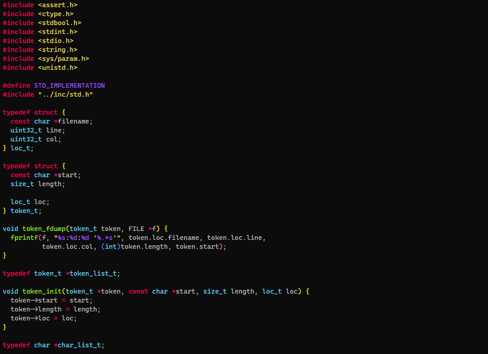

# Monokai Remastered
A Very dark monokai theme based on a terminal look.
Currently only tested support for the c programming language.

# Installation
1. Clone the repository
2. Open vscode
3. EExecute the command `Developer: Install Extension from location...` and navigate to the repository
