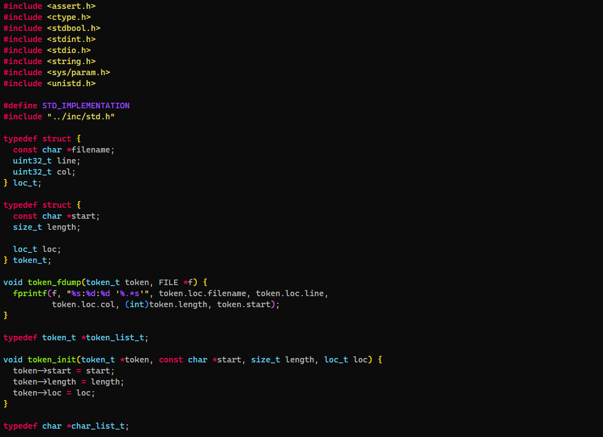

# Monokai Remastered
A Very dark monokai theme based on a terminal look.
Currently tried the theme with c and zig.

# Installation:
1. Clone the repository.
2. Open vscode.
3. Execute the command `Developer: Install Extension from location...` and navigate to the repository.
4. Optional: Nice support for C++ is dependent on the [Better C++ Syntax](https://marketplace.visualstudio.com/items?itemName=jeff-hykin.better-cpp-syntax) Extension that shas to be installed from the Extensions Marketplace.
